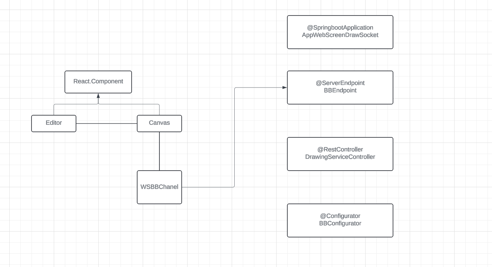
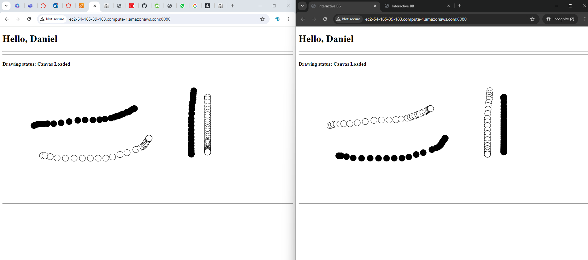

# Client Concurrent
This for multi user.
[Repository in GitHub here](https://github.com/JffMv/webSocket-ScreenDraw)

## Getting Started

For clone this repository you use this command:
 ```
 git clone https://github.com/JffMv/ApiREST-Java.git
 ```

### Prerequisites

Have installed:
maven 3.9.6
[Install Maven](https://maven.apache.org/download.cgi#Installation)


git 2.44
[Install Git](https://git-scm.com/book/en/v2/Getting-Started-Installing-Git)

java
[Install Java](https://www.oracle.com/co/java/technologies/downloads/)


## Running the tests

This classes haven´t unit test

## Deployment


The process were building project maven with the command:

```
mvn archetype:generate -DgroupId=org.example -DartifactId=CALCULATOR -DarchetypeArtifactId=maven-archetype-quickstart -DinteractiveMode=false

```

Then we have verify the class App.java and the pom.xml, run the project with:

```
mvn package
```


For generate documentation update the pom.xml add and later use "mvn package":

```
<reporting>
    <plugins>
    <plugin>
    <groupId>org.apache.maven.plugins</groupId>
    <artifactId>maven-javadoc-plugin</artifactId>
    <version>2.10.1</version>
    <configuration>
    </configuration>
    </plugin>
    </plugins>
</reporting>
```


## Architecture


This project has two architectures: one for the front-end and another for the back-end. The front-end is initialized with React, where it calls the Editor, and within the Editor, it calls Canvas, which contains the logic to render the screen based on p5. Canvas connects to the server through a WSBBChannel object, which is created using a class within the same project and expects a URL to establish the server connection. In summary, React displays the Editor as the skeleton for the Canvas to render actions, and within the Canvas, a WSBBChannel object connects to the server.

On the other hand, the back-end architecture supports endpoints, with "/bbService" handling the creation, saving, and modification of sessions, which are listening and sending messages as they are modified. There are specific configurations to ensure concurrency with this endpoint. The Spring Boot application startup class includes a configuration for the port where the endpoint is listening. In BBConfigurator, it informs Spring Boot that this technology will be used and to keep listening. Lastly, there is an implementation of DrawingServiceController to confirm that the server is responding.

It may not be running currently because the service closes upon disconnect. However the app is work.


The following image shows the deployed service being consumed from AWS at the link:
http://ec2-54-165-39-183.compute-1.amazonaws.com:8080/


## Built With

* [Java](https://www.java.com/es/) - The language used
* [Maven](https://maven.apache.org/) - Dependency Management


## Authors

* **Yeferson Mesa**

## License

This project is licensed under the MIT License - see the [LICENCE.txt](LICENCE.txt) file for details