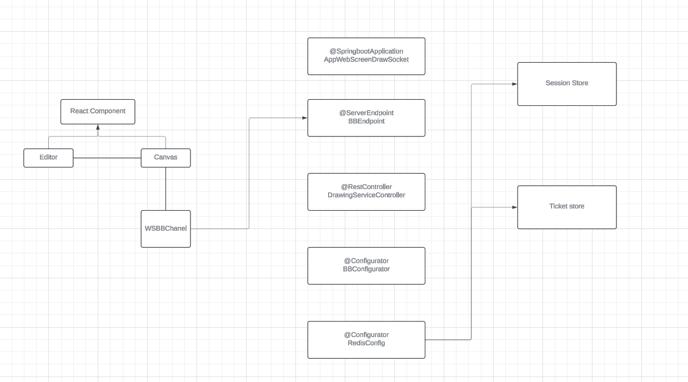

# Client Concurrent
This for multi user.
[Repository in GitHub here](https://github.com/JffMv/webSocket-ScreenDraw)

## Getting Started

For clone this repository you use this command:
 ```
 git clone https://github.com/JffMv/ApiREST-Java.git
 ```

### Prerequisites

Have installed:
maven 3.9.6
[Install Maven](https://maven.apache.org/download.cgi#Installation)


git 2.44
[Install Git](https://git-scm.com/book/en/v2/Getting-Started-Installing-Git)

java
[Install Java](https://www.oracle.com/co/java/technologies/downloads/)


## Running the tests

This classes haven´t unit test

## Deployment


The process were building project maven with the command:

```
mvn archetype:generate -DgroupId=org.example -DartifactId=CALCULATOR -DarchetypeArtifactId=maven-archetype-quickstart -DinteractiveMode=false

```

Then we have verify the class App.java and the pom.xml, run the project with:

```
mvn package
```


For generate documentation update the pom.xml add and later use "mvn package":

```
<reporting>
    <plugins>
    <plugin>
    <groupId>org.apache.maven.plugins</groupId>
    <artifactId>maven-javadoc-plugin</artifactId>
    <version>2.10.1</version>
    <configuration>
    </configuration>
    </plugin>
    </plugins>
</reporting>
```


## Architecture


Este proyecto tiene una arquitectura de 
This project is based on a REST API architecture where it consumes a service from the URL https://www.alphavantage.co/. The service sends a JSON file containing company data.

It's worth noting that a JavaScript client is created to consume the REST service created in Java, which in turn consumes the API. Additionally, there is a concurrent client from the `Concurrent` class in Java that consumes the REST service as depicted in the following image.


The following image shows the deployed service being consumed from AWS at the link:
http://ec2-54-165-39-183.compute-1.amazonaws.com:8080/

It may not be running currently because the service closes upon disconnect. However the app is work.


## Extensibility

The project features an extensible design with a proposed interface so that when implemented in a new class, it can be modified and customized as needed for the service.


## Built With

* [Java](https://www.java.com/es/) - The language used
* [Maven](https://maven.apache.org/) - Dependency Management


## Authors

* **Yeferson Mesa**

## License

This project is licensed under the MIT License - see the [LICENSE.txt](LICENSE.txt) file for details